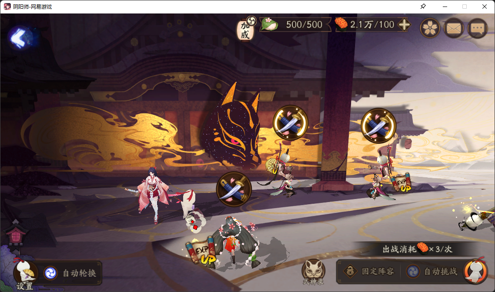
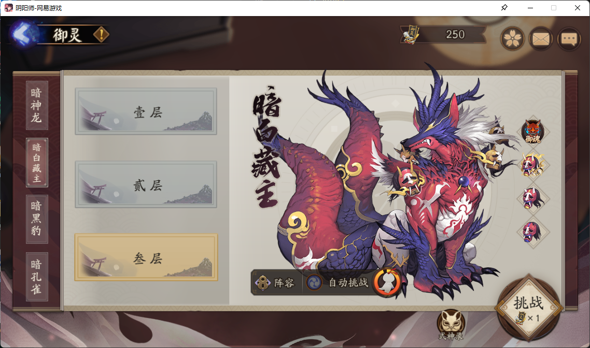
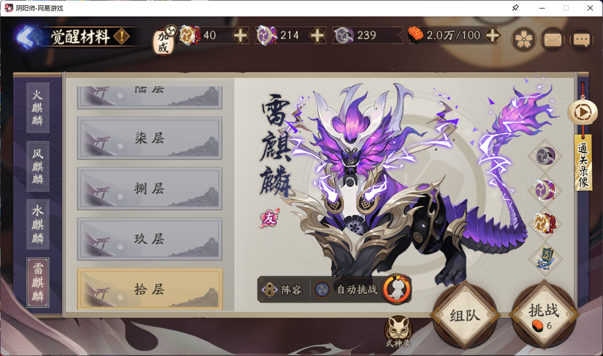
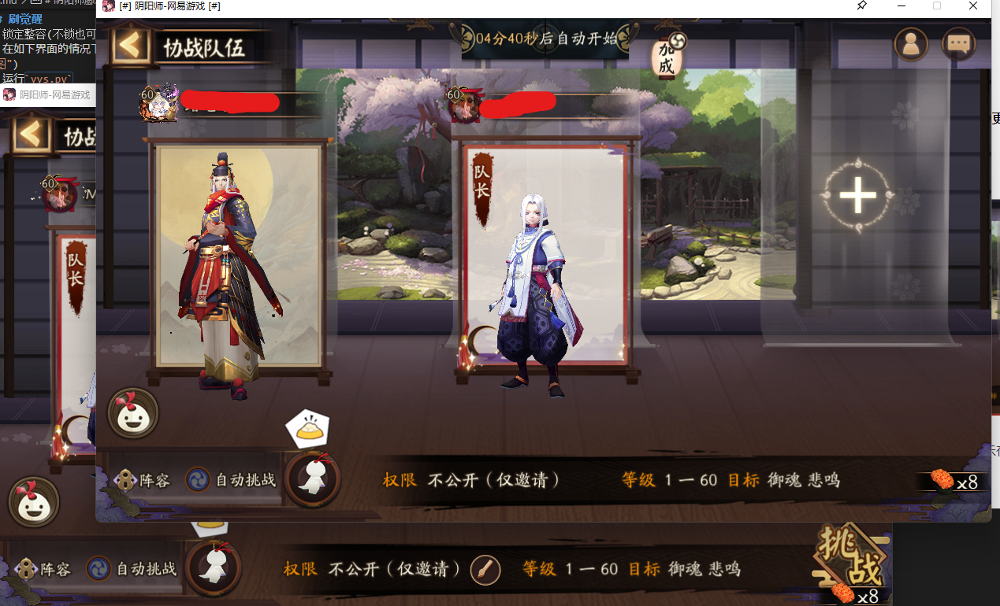
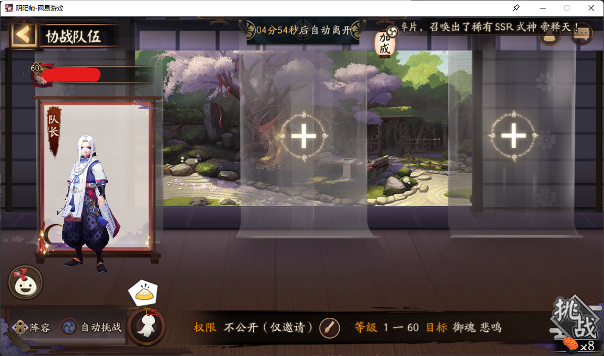
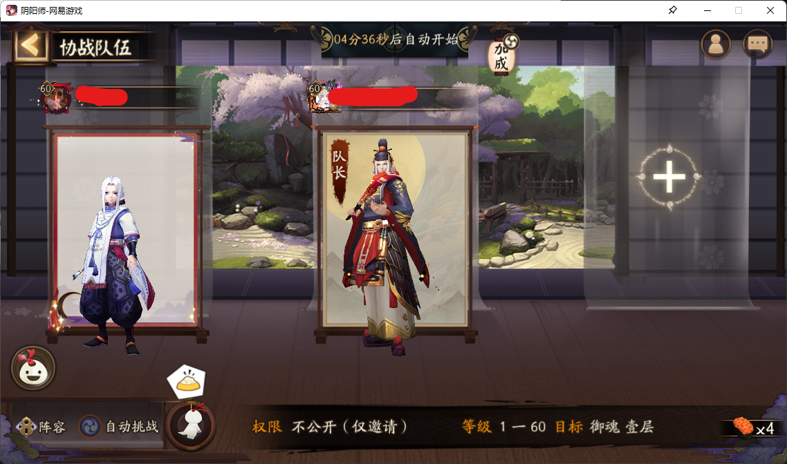

# 阴阳师脚本
## 声明
有被封的可能性，但是我自己用了两年了还没有被封

## 特色
1. 支持后台
2. 无鼠标冲突
3. 魂土双开
4. 狗粮只刷经验怪或金币怪
5. 小范围分辨率变化无影响

## 环境
keyboard==0.13.5

numpy==1.23.5

opencv-contrib-python==4.6.0.66

opencv-python==4.6.0.66

Pillow==9.3.0

PyAutoGUI==0.9.53

pywin32==305

## 注意事项
1. 管理员运行IDE
2. 笔记本电脑记得缩放调成百分百

## 目前可用功能
第一次弄开源项目，所以很多东西还不太会弄，自己代码也是屎山。会一个个更新好,练练重构能力
### 刷狗粮
1. 开启自动轮换模式
2. 在如下界面的情况下运行程序
3. 运行`yys.py`
4. 按说明选择`狗粮`
5. 选择客户端模式

### 刷御灵
1. 锁定整容(不锁也可以，但是速度会比较慢)
2. 在如下界面的情况下运行程序
3. 运行`yys.py`
4. 按说明选择`御灵`
5. 选择`桌面版`

### 刷觉醒
1. 锁定整容(不锁也可以，但是速度会比较慢)
2. 在如下界面的情况下运行程序
3. 运行`yys.py`
4. 按说明选择`觉醒`
5. 选择`桌面版`

### 魂土双开
1. 下载[沙盒](https://sandboxie-plus.com/downloads/),并安装
   - 沙盒可以理解为另一个环境，相比其他软件来说比较小巧
   - 如果链接打不开可以联系我 
2. 先直接运行桌面版阴阳师
3. 右键桌面阴阳师图标，然后点击**在沙盒中运行**（win11可能还需要点击**显示更多选项**才能看到）
   - 沙盒的窗口名字会有个#符号
  
1. 进入如下界面的情况下运行程序，魂土两个号都要锁定整容。
   - 注意点是**要把司机放在打手的上层**。图中的沙盒版的是打手，所以显示在上层。
     - 不然程序会找不准，可能是#这个符号不在句柄区别范围内，算是目前的一个小bug可，知道怎么解决的可以联系本人或者request。
    
   
2. 运行`yys.py`
3. 按说明选择`魂土双开`
4. 选择`桌面版`
### 魂土司机
1. 锁定整容(不锁也可以，但是速度会比较慢)
2. 在如下界面的情况下运行程序
3. 运行`yys.py`
4. 按说明选择`魂土司机`
   - 会自动发送邀请，没成功可以自己发送
5. 选择`桌面版`
### 魂土打手
1. 锁定整容(不锁也可以，但是速度会比较慢)
2. 在如下界面的情况下运行程序
3. 运行`yys.py`
4. 按说明选择`魂土打手`
   - 会自动接受邀请，没成功可以自己点击
5. 选择`桌面版`

以上就是目前基本能运行的所有功能，程序中可能还有古怪的没有利用的函数，那是因为笔者当时尝试但没有成功的功能。包括但不限于以下，有心人可以尝试去实现下，笔者已经没有这个精力了。
1. 模拟器脚本。所以功能中一直有个模拟器。
   - 问题点主要是windowsAPI的鼠标点击无法传送到模拟器上，所以无法实现后台，烂尾了。
2. 多人探索。难度太大。试了试直接放弃了。
3. 自动换狗粮。当时实现了换一个狗粮，但阴阳师自己出了这个功能，挺好的。
4. 活动。阴阳师活动各种小变化，还可以挂饼，也烂尾了。